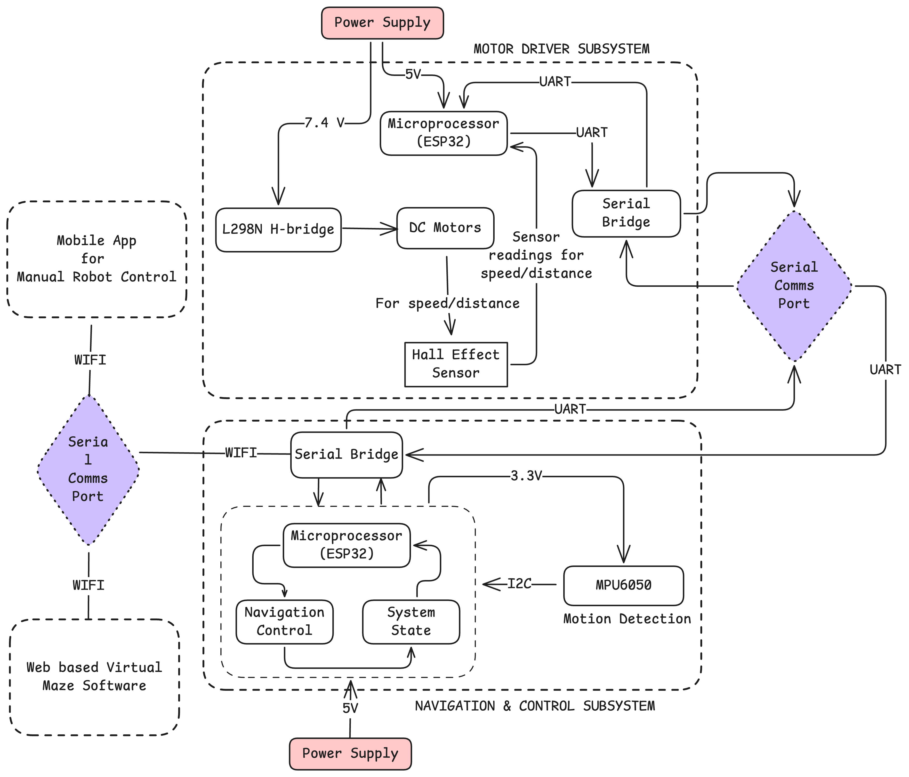

# RAVVEN Engineering Data Package (EDP)

> **🚧 Building in Public:**
> Follow the engineering log and join the course waitlist at **[blog.ravven.dev](https://blog.ravven.dev)**.
> *Subscribe to get the latest EDP updates sent directly to your inbox.*

---

This repository contains the official **Engineering Data Package (EDP)** for RAVVEN (**R**ust-based **A**utonomous **V**ehicle for **V**irtual **E**nvironment **N**avigation). A dual ESP32 autonomous robot with real-time virtual synchronization. The EDP serves as the technical foundation for an embedded systems engineering course teaching bare-metal Rust development.

## 🔭 Overview

Unlike traditional hobbyist guides, RAVVEN documentation is structured as a professional systems engineering suite. These documents define the architecture, communication protocols, and hardware specifications required to build and program the robot.

## 🏗️ System Architecture

**Key Design Elements:**

* **Dual-ESP32 Architecture:** Separation of motor control (MDS) from navigation logic (NavCon) across two microcontrollers
* **Digital Twin Synchronization:** Physical robot state mirrored in real-time browser-based visualization
* **UART Inter-Processor Communication:** 19,200 bps serial link optimized for reliability in electrically noisy environments
* **Bare-Metal Rust Implementation:** Direct hardware control using `no_std` Rust for memory safety and deterministic behavior

## 📂 Engineering Data Package (EDP) Index

The EDP is a complete repository of manufacturing (3D printing) and design files. The package is organized into **Specifications** (PDFs) and **Hardware Assets** (Source Files)

### 1. Specifications

The documentation is split into four distinct specifications.

| Document ID | Title | Status | Description |
| :--- | :--- | :--- | :--- |
| **DOC-A** | **System Architecture Specification (SAS)** | ✅ **Released** | The high-level design document. Defines the "Puppet" architecture, the 3-node topology (Motor, Nav, Twin), and functional requirements. **Start here.** |
| **DOC-B** | **Interface Control Document (ICD)** | ✅ **Released** | The technical reference for communication. Defines the UART packet structure, State Machine logic, and Command Library hex codes. |
| **DOC-C** | **Integration & Assembly Manual** | 🚧 *In Progress* | Step-by-step hardware build guide, BOM (Bill of Materials), and 3D print specifications. |
| **DOC-D** | **Hardware Reference Manual** | 🚧 *In Progress* | Electrical datasheets, PCB pinouts, and expansion board specifications. |

### 2. Hardware Assets

These are the raw hardware design files

| Artifact | Format | Status | Description |
| :--- | :--- | :--- | :--- |
| **3D Models** | `.STL` / `.STEP` | 🚧 *In Progress* | CAD files for the chassis, sensor mounts, and motor brackets. |
| **PCB Design** | KiCad / Gerber | 🚧 *In Progress* | Complete schematics and board layout for the RAVVEN Mainboard and Expansion Shield. |
| **Bill of Materials** | `.CSV` / Interactive | 🚧 *In Progress* | Full component list with LCSC/Digikey part numbers, sourcing links, and alternatives. |

## 🚀 Getting Started

If you are new to the project, please read the documents in the following order:

1.  **Read the SAS (System Architecture Specification):** This explains *why* we use dual ESP32s and how the "Digital Twin" synchronization works.
2.  **Read the ICD (Interface Control Document):** Essential for writing your firmware drivers. It contains the exact byte-level protocols you need to implement.
3.  **Check the Releases:** Download the latest stable PDFs from the [Releases Page](../../releases).

## 🛠 Project Context

RAVVEN is an educational platform designed to teach **Embedded Systems Engineering with Rust**.

* **Firmware:** Built on `no_std` Rust using `esp-hal`.
* **Hardware:** Custom dual-ESP32 architecture (Motor Subsystem + Navigation Subsystem).
* **Simulation:** Real-time browser-based Digital Twin (Virtual Maze).

## ⚡ Technical Stack

**Hardware:**
* 2x ESP32-WROOM-32 microcontrollers
* L298N dual H-bridge motor driver
* N20 micro metal gearmotors with hall effect encoders
* MPU6050 6-DOF IMU
* 7.4V Li-ion battery system

**Firmware:**
* Rust (2024 Edition)
* `esp-hal` for hardware abstraction
* `embassy` for async runtime (optional)
* Bare-metal `no_std` implementation

## 📦 Download

You can download the compiled PDF versions of these documents from the **[Latest Release](../../releases)** section of this repository.

## 📄 License

The documentation in this repository is licensed under a [Creative Commons Attribution-ShareAlike 4.0 International License](http://creativecommons.org/licenses/by-sa/4.0/).

---
*Maintained by Tanya Masvita. Visit [blog.ravven.dev](https://blog.ravven.dev) to follow the engineering log.*
